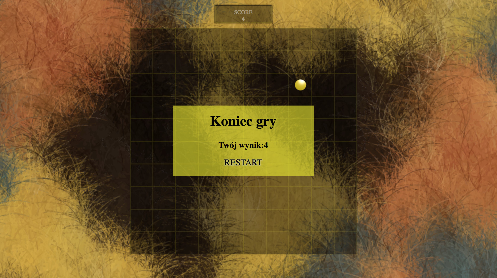

# Furry Game
Simply game made as homework.
Technologies: HTML5, CSS3, JavaScript, Webpack.

### How to install:
1. `git clone https://github.com/karolkalkus/Furry_game.git`
2. `cd Furry_game`
3. `npm i`

Then `node_modules/.bin/webpack`.

[Furry Game](https://karolkalkus.github.io/Furry_game/.)
